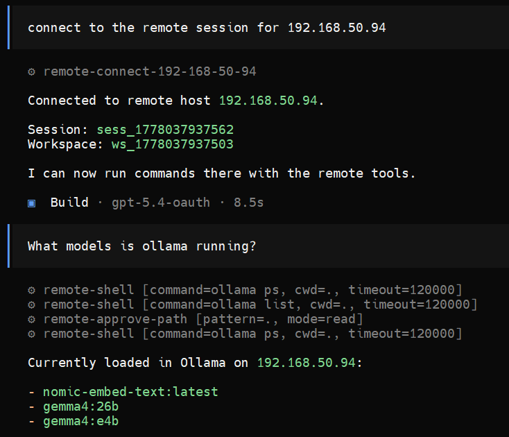

# opencode-remote-ssh

Provider-based remote workspace plugin and Go stub for using OpenCode against older Linux hosts (or those which cannot for one reason or another install Opencode) over SSH.



## Overview

opencode-remote-ssh-ssh enables OpenCode to work seamlessly with remote Linux hosts that cannot run OpenCode directly (e.g., older systems, minimal environments). It uses SSH for transport and a self-contained Go stub as the remote execution boundary.

## Features

- **Provider-Based Host Management**: Define collections of remote hosts organized by providers with label-based selection
- **SSH Bootstrap**: Automatically uploads and installs the Go stub to remote hosts
- **Local Tunnel**: Creates SSH port forwarding so the remote appears as a local endpoint
- **Permission-First Security**: Path access is denied by default; approvals are requested through OpenCode's normal permission flow
- **Persistent Approvals**: `always` approvals persist across stub restarts for the same workspace
- **Self-Contained Stub**: No dependencies on the remote host - just a single static binary
- **OpenCode-Compatible API**: Implements workspace, session, shell, and permission endpoints

## Architecture

```
┌─────────────────┐      SSH + Tunnel      ┌─────────────────┐
│   Local OpenCode│ ──────────────────────▶│   Remote Host    │
│   + Plugin      │                        │   + Go Stub      │
└─────────────────┘                        └─────────────────┘
        │                                          │
        │ Workspace Adaptor                       │
        │ - provider/host selection               │
        │ - SSH bootstrap                         │
        │ - tunnel management                     │
        │ - target URL + headers                  │
        │                                          │
        ▼                                          ▼
  ┌──────────┐                              ┌──────────────┐
  │ Provider │                              │ Remote API   │
  │ Registry │                              │ - workspace  │
  └──────────┘                              │ - session    │
                                            │ - shell      │
                                            │ - permission │
                                            └──────────────┘
```

### Components

| Component | Location | Description |
|-----------|----------|-------------|
| Plugin | `plugin/` | TypeScript workspace adaptor for OpenCode |
| Stub | `stub/` | Go HTTP service installed on remote hosts |
| Setup Script | `scripts/setup-host.sh` | SSH-based remote setup automation |
| Test Script | `scripts/run-local-stub.sh` | Local stub testing helper |
| CLI Tool | `scripts/opencode-remote-ssh-cli.sh` | Manage hosts in OpenCode config |

## Requirements

- **Local**: OpenCode, Node.js (for plugin), Go 1.21+ (for stub build)
- **Remote**: Linux (x86_64 or arm64), SSH access, any POSIX shell

## Quick Start (Recommended - Using CLI)

The easiest way to get started is using the CLI tool:

```bash
# Add a host and set up the remote in one command
./scripts/opencode-remote-ssh-cli.sh setup <host> <user> [port] [identity-file]

# Example:
./scripts/opencode-remote-ssh-cli.sh setup 10.0.0.10 ops 22 ~/.ssh/id_ed25519
```

This will:
1. **Add the host** to your OpenCode config under a default provider
2. **Create SSH key** (if no identity file provided): Generates a dedicated key `~/.ssh/opencode-remote-ssh-<hostname>`
3. **Transfer key** (if password provided): Adds the new key to the remote's `authorized_keys`
4. **SSH to remote**: Connect using the new key
5. **Upload stub**: Copy the Go binary to `~/.opencode-remote-ssh/bin/`
6. **Generate token**: Create an authentication token on the remote
7. **Start stub**: Launch the remote stub process
8. **Create tunnel**: Set up SSH port forwarding to the remote
9. **Test connection**: Verify the remote API is accessible
10. **Output results**: Show the connection details

### First-Time Setup Flow

If this is your first time setting up a remote:

```bash
# 1. Clone/download this repository
# 2. Build the stub (if not pre-built)
cd stub && go build -o bin/opencode-remote-ssh-stub ./cmd && cd ..

# 3. Run setup (it will create a new SSH key and transfer it)
./scripts/opencode-remote-ssh-cli.sh setup <host-ip> <username>

# The script will ask for your password ONCE to transfer the key
# After that, key-based auth is used
```

### Re-Running Setup

If you run setup again:
- It won't create duplicate SSH keys
- It won't add duplicate host entries in config
- It will just update/reconnect to the existing stub

### Alternative: Manual Setup

#### 1. Build the Stub

```bash
cd stub
go build -o bin/opencode-remote-ssh-stub ./cmd
```

#### 2. Set Up a Remote Host

```bash
./scripts/setup-host.sh <host> <user> [port] [identity-file]

# Example:
./scripts/setup-host.sh 10.0.0.10 ops 22 ~/.ssh/id_ed25519
```

The script will:
1. Test SSH connectivity
2. Create `~/.opencode-remote-ssh` directories on the remote
3. Upload the stub binary
4. Generate an auth token
5. Start the stub
6. Test the connection via SSH tunnel

### 3. Configure OpenCode

Add the plugin configuration to your OpenCode config:

```json
{
  "plugin": [
    ["opencode-remote-ssh-provider", {
      "providers": {
        "my-servers": {
          "strategy": "first_available",
          "hosts": [
            {
              "name": "server-01",
              "ssh": {
                "host": "10.0.0.10",
                "user": "ops",
                "port": 22,
                "identityFile": "~/.ssh/id_ed25519"
              },
              "labels": ["linux", "production"]
            },
            {
              "name": "server-02",
              "ssh": {
                "host": "10.0.0.11",
                "user": "ops",
                "port": 22
              },
              "labels": ["linux", "staging"]
            }
          ]
        }
      }
    }]
  ]
}
```

### 4. Enable Workspaces in OpenCode

Before using remote workspaces, you must enable the experimental workspaces feature:

1. Press **Ctrl+P** in OpenCode
2. Search for "Enable workspaces" 
3. Enable the feature

> **Note**: If you don't see this option, you may need to install the `opencode-workspaces` plugin separately.

### 5. Use the Remote Workspace

When creating a workspace, specify the provider:

```json
{
  "type": "ssh-provider",
  "extra": {
    "provider": "my-servers"
  }
}
```

Or select a specific host:

```json
{
  "type": "ssh-provider",
  "extra": {
    "provider": "my-servers",
    "host": "server-01"
  }
}
```

### Using Remote Workspaces

Since the TUI workspace menu may not always show the SSH Provider option, the plugin provides **custom tools** for direct remote control:

**In your OpenCode chat, tell the AI:**

```
Create a remote workspace called "my-workspace" on the my-servers provider
```

This will:
1. Connect to your configured host via SSH
2. Start the remote stub (if not already running)
3. Create an SSH tunnel to the remote
4. Establish a workspace and session on the remote

**Other available commands:**

- `Connect to remote` - Switch to the remote workspace
- `List files on remote` - List files on the remote host
- `Run <command> on remote` - Execute a command on the remote
- `Disconnect from remote` - Close the connection

**Manual connection:**

You can also use the custom tools directly:
- `remote-switch` - Connect to remote workspace
- `remote-shell` - Run commands on remote
- `remote-ls` - List remote files
- `remote-disconnect` - Disconnect from remote

## CLI Commands

The `opencode-remote-ssh-cli.sh` script manages hosts in your OpenCode config:

```bash
# Add a host to a provider
./scripts/opencode-remote-ssh-cli.sh add <provider> <host> <user> [port] [identity-file]
# Example:
./scripts/opencode-remote-ssh-cli.sh add prod-servers 10.0.0.10 ops 22 ~/.ssh/id_ed25519

# Remove a host from a provider
./scripts/opencode-remote-ssh-cli.sh remove <provider> <host>
# Example:
./scripts/opencode-remote-ssh-cli.sh remove prod-servers 10.0.0.10

# List all configured hosts
./scripts/opencode-remote-ssh-cli.sh list

# Initialize the plugin (usually done automatically)
./scripts/opencode-remote-ssh-cli.sh init

# Add host AND set up remote stub in one command
./scripts/opencode-remote-ssh-cli.sh setup <host> <user> [port] [identity-file]
# Example:
./scripts/opencode-remote-ssh-cli.sh setup 10.0.0.10 ops 22 ~/.ssh/id_ed25519
```

**Note**: Each config modification automatically creates a timestamped backup at `~/.config/opencode/opencode.json.backup.YYYYMMDD_HHMMSS`.

## Configuration Reference

### Plugin Configuration

```json
{
  "plugin": [
    ["opencode-remote-ssh-provider", {
      "installRoot": "~/.opencode-remote-ssh",
      "tunnel": {
        "localPortRange": [39000, 39999],
        "connectTimeoutMs": 15000,
        "healthTimeoutMs": 5000
      },
      "defaults": {
        "selectionStrategy": "first_available",
        "leaseMode": "exclusive",
        "stubPort": 39217
      },
      "providers": {
        "provider-name": {
          "strategy": "first_available",
          "labels": ["linux"],
          "hosts": [
            {
              "name": "host-name",
              "ssh": {
                "host": "IP or hostname",
                "user": "username",
                "port": 22,
                "identityFile": "~/.ssh/key",
                "proxyJump": "jump-host"
              },
              "labels": ["label1", "label2"]
            }
          ]
        }
      }
    }]
  ]
}
```

### Configuration Options

| Option | Type | Default | Description |
|--------|------|---------|-------------|
| `installRoot` | string | `~/.opencode-remote-ssh` | Remote installation directory |
| `tunnel.localPortRange` | `[number, number]` | `[39000, 39999]` | Local port allocation range |
| `tunnel.connectTimeoutMs` | number | `15000` | SSH connection timeout |
| `tunnel.healthTimeoutMs` | number | `5000` | Health check timeout |
| `defaults.selectionStrategy` | string | `first_available` | Host selection policy |
| `defaults.leaseMode` | string | `exclusive` | Lease behavior |
| `defaults.stubPort` | number | `39217` | Remote stub port |

### Provider Options

| Option | Type | Description |
|--------|------|-------------|
| `strategy` | string | Selection strategy (`first_available`) |
| `labels` | string[] | Default labels for host filtering |
| `hosts` | HostConfig[] | List of hosts in this provider |

### Host Options

| Option | Type | Description |
|--------|------|-------------|
| `name` | string | Unique host identifier |
| `ssh.host` | string | Hostname or IP address |
| `ssh.user` | string | SSH username |
| `ssh.port` | number | SSH port (default: 22) |
| `ssh.identityFile` | string | Path to SSH private key |
| `ssh.proxyJump` | string | SSH jump host |
| `labels` | string[] | Labels for filtering |

## Local Testing

### Run Stub Locally

```bash
./scripts/run-local-stub.sh start    # Start stub
./scripts/run-local-stub.sh test     # Test endpoints
./scripts/run-local-stub.sh status   # Check status
./scripts/run-local-stub.sh stop    # Stop stub
```

### Manual Stub Run

```bash
# Generate token
printf '%s' "$(openssl rand -hex 24)" > /tmp/token

# Create state directories
mkdir -p /tmp/state/{workspaces,sessions,approvals}

# Run stub
./stub/bin/opencode-remote-ssh-stub \
  --listen 127.0.0.1:39217 \
  --token-file /tmp/token \
  --state-dir /tmp/state \
  --log-file /tmp/stub.log

# Test
curl -H "Authorization: Bearer $(cat /tmp/token)" \
  http://127.0.0.1:39217/global/health
```

## Permission System

### How It Works

1. **Default Deny**: All path access is denied by default
2. **On First Access**: When a command tries to access an unapproved path, a permission request is created
3. **User Approval**: The permission appears in OpenCode's normal permission UI
4. **Approval Types**:
   - `once`: Allows exactly one operation
   - `always`: Persists approval for the workspace on that host
   - `reject`: Denies the request

### Approval Persistence

- `once` approvals are stored in memory only
- `always` approvals are persisted to the filesystem (`~/.opencode-approvals/`)
- Approvals survive stub restarts
- Approvals are workspace-specific (not shared across workspaces)

## Remote Install Layout

On the remote host, files are installed under `~/.opencode-remote-ssh/`:

```
~/.opencode-remote-ssh/
├── bin/
│   └── opencode-remote-ssh-stub     # The Go binary
├── run/
│   ├── stub.token               # Auth token
│   └── stub.pid                 # PID file (optional)
├── log/
│   └── stub.log                 # Runtime log
├── state/
│   ├── workspaces/              # Workspace records
│   ├── sessions/               # Session records
│   └── approvals/              # Persisted always-approvals
└── version                      # Version marker
```

## API Endpoints

The stub implements these OpenCode-compatible endpoints:

| Endpoint | Method | Description |
|----------|--------|-------------|
| `/global/health` | GET | Health/version check |
| `/global/event` | GET | SSE event stream |
| `/experimental/workspace/adaptor` | GET | List workspace adaptors |
| `/experimental/workspace` | GET/POST | List/create workspaces |
| `/experimental/workspace/status` | GET | Workspace status |
| `/experimental/workspace/{id}` | DELETE | Delete workspace |
| `/session` | POST | Create session |
| `/session/status` | GET | Session status |
| `/session/{id}` | GET/DELETE | Get/delete session |
| `/session/{id}/shell` | POST | Execute shell command |
| `/session/{id}/command` | POST | Execute structured command |
| `/permission` | GET | List permission requests |
| `/permission/{id}/reply` | POST | Reply to permission |

## Security

- Stub binds only to `127.0.0.1` (localhost only)
- All requests require bearer token authentication
- Path access denied by default
- Symlink escape attempts are blocked
- Commands constrained to approved directories

## Troubleshooting

### SSH Key Authentication Fails

If the script fails with "Permission denied" when trying to connect:
1. The script will attempt password-based authentication to add a new SSH key
2. If sshpass is not installed, you'll see instructions to add the key manually
3. To add manually:
   ```bash
   # Show the public key
   cat ~/.ssh/opencode-remote-ssh-<hostname>.pub
   
   # SSH to remote with your existing credentials
   # Add the public key to ~/.ssh/authorized_keys on the remote
   ```

### Stub Won't Start on Remote

Check the remote log:
```bash
ssh -i ~/.ssh/opencode-remote-ssh-<hostname> user@host "cat ~/.opencode-remote-ssh/log/stub.log"
```

Common issues:
- Binary may not have execute permission: `chmod +x ~/.opencode-remote-ssh/bin/opencode-remote-ssh-stub`
- Port 39217 may already be in use on remote: check with `ss -tlnp | grep 39217`

### Connection Refused (after tunnel is active)

1. Verify stub is running on remote:
   ```bash
   ssh -i ~/.ssh/opencode-remote-ssh-<hostname> user@host "pgrep -la remote-stub"
   ```

2. Check the token matches:
   ```bash
   # On local
   ssh user@host "cat ~/.opencode-remote-ssh/run/stub.token"
   
   # Use that token in requests
   curl -H "Authorization: Bearer <token>" http://127.0.0.1:39300/global/health
   ```

3. Ensure SSH tunnel is active:
   ```bash
   ssh -i ~/.ssh/opencode-remote-ssh-<hostname> -N -L 39300:127.0.0.1:39217 user@host
   ```

### Permission Denied for Path Access

This is expected behavior - access is denied by default. When you attempt to access a path:
1. A permission request is created
2. You'll see it via `GET /permission`
3. Approve with `POST /permission/{id}/reply` with `{"reply": "always"}`

To verify approvals exist:
```bash
ssh user@host "ls ~/.opencode-remote-ssh/state/approvals/"
```

### "No such file or directory" during SCP

This usually means the SSH port option wasn't correctly translated. The script handles this, but if you see it:
- Ensure you're using the script (not raw scp)
- The script converts `-p PORT` for SSH to `-P PORT` for SCP

### Duplicate Entries in Config

The CLI tool prevents duplicates:
- `add` command checks if host already exists in provider before adding
- Config modifications create automatic timestamped backups
- Use `list` to see current configuration without changes

### Tunnel Port Already in Use

If local port 39300 is in use, the script will try 39301, 39302, etc. To check manually:
```bash
ss -tlnp | grep 39300
lsof -i :39300
```

### Stub Process Exits After SSH Connection Closes

If the stub stops running after you disconnect from SSH, you'll need to keep it running persistently. Options:

1. **Keep SSH session running**: Use `-f` to background the tunnel
2. **Create a systemd service** on the remote:
   ```bash
   # On remote host
sudo tee /etc/systemd/system/opencode-remote-ssh.service << 'EOF'
[Unit]
Description=OpenCode Remote Stub

[Service]
Type=simple
User=<your-username>
ExecStart=/home/<your-username>/.opencode-remote-ssh/bin/opencode-remote-ssh-stub \
  --listen 127.0.0.1:39217 \
  --token-file /home/<your-username>/.opencode-remote-ssh/run/stub.token \
  --state-dir /home/<your-username>/.opencode-remote-ssh/state \
  --log-file /home/<your-username>/.opencode-remote-ssh/log/stub.log
Restart=always

[Install]
WantedBy=multi-user.target
EOF
   
   sudo systemctl daemon-reload
   sudo systemctl enable opencode-remote-ssh
   sudo systemctl start opencode-remote-ssh
   ```

## Manual Testing

Once setup is complete, you can test manually:

```bash
# 1. Start SSH tunnel (keep this running)
ssh -i ~/.ssh/opencode-remote-ssh-<hostname> -N -L 39300:127.0.0.1:39217 user@hostname

# 2. Get the token from remote
TOKEN=$(ssh -i ~/.ssh/opencode-remote-ssh-<hostname> user@hostname 'cat ~/.opencode-remote-ssh/run/stub.token')

# 3. Test health endpoint
curl -H "Authorization: Bearer $TOKEN" http://127.0.0.1:39300/global/health

# 4. Test workspace adaptor
curl -H "Authorization: Bearer $TOKEN" http://127.0.0.1:39300/experimental/workspace/adaptor

# 5. Create a test session
curl -X POST -H "Authorization: Bearer $TOKEN" \
  -H "Content-Type: application/json" \
  -d '{"title":"test","workspaceID":"test-ws"}' \
  http://127.0.0.1:39300/session
```

## Development

### Build Plugin

```bash
cd plugin
npm install
npm run build
```

### Build Stub

```bash
cd stub
go build -o bin/opencode-remote-ssh-stub ./cmd
```

### Project Structure

```
opencode-remote-ssh/
├── plugin/                 # OpenCode workspace adaptor
│   ├── src/
│   │   ├── index.ts       # Plugin entry point
│   │   ├── config.ts      # Config validation
│   │   ├── provider.ts    # Provider/host selection
│   │   ├── leases.ts      # Lease management
│   │   ├── ssh.ts         # SSH bootstrap
│   │   ├── adaptor.ts    # Workspace adaptor
│   │   └── types.ts      # Type definitions
│   └── package.json
├── stub/                   # Go remote stub
│   ├── cmd/
│   │   └── main.go        # Entry point
│   └── internal/
│       ├── auth/          # Token auth middleware
│       ├── handler/       # HTTP handlers
│       └── state/         # State management
├── scripts/
│   ├── setup-host.sh     # Remote setup
│   └── run-local-stub.sh # Local testing
├── ARCHITECTURE.md        # Architecture docs
├── IMPLEMENTATION_CHECKLIST.md
└── TEST_PLAN.md
```

## License

MIT
