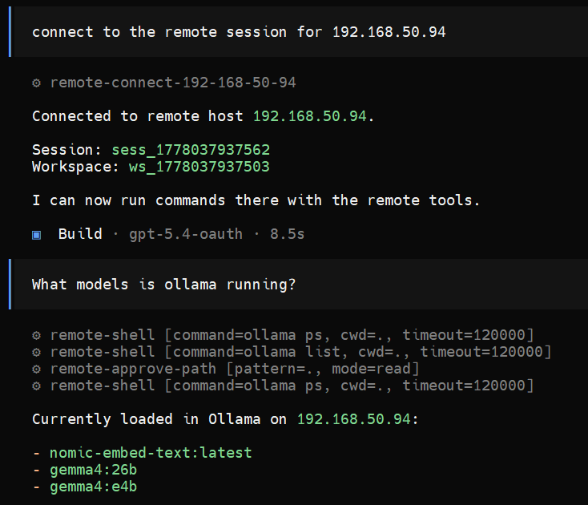

# opencode-remote-ssh



Provider-based remote workspace plugin and Go stub for using OpenCode against Linux hosts that cannot run OpenCode directly.

## Overview

`opencode-remote-ssh` lets OpenCode work against remote Linux machines over SSH.
The system has two parts:

1. A local OpenCode plugin that resolves configured hosts, manages SSH bootstrap, and exposes a remote workspace target.
2. A small Go stub installed on the remote host that serves an OpenCode-compatible API over an SSH tunnel.

## Supported Modes

There are two ways to load the plugin in your local OpenCode config:

1. Package-based plugin registration
2. Path-based local development registration

The public, automated path in this repository is **package-based registration**.

The helper CLI `scripts/opencode-remote-cli.sh` only manages **package-based** plugin config entries.
If you are loading the plugin from a local filesystem path during development, edit your config manually.

## Features

- Provider-based host management
- Explicit host selection by configured `name`, real `ssh.host`, or friendly `aliases`
- SSH bootstrap for the remote stub
- Hash-checked stub installation that reuses the installed binary when it already matches
- Plugin-managed SSH tunneling with tracked local tunnel teardown
- Collision-aware local tunnel port selection
- Persisted binding recovery with stale-state cleanup after restarts
- Permission-first path access
- `once` and persistent `always` approvals per workspace
- Self-contained remote stub binary
- Workspace session restore support
- Shell and command execution endpoints on the remote stub
- User-facing `remote-switch`, `remote-status`, `remote-disconnect`, and `remote-doctor` tools
- Lower-level `remote-workspace-create`, `remote-workspace-list`, and `remote-workspace-remove` tools
- Configurable local `stubBinaryPath` override when auto-discovery is not suitable
- Live remote lifecycle harness for validating a configured host before relying on interactive use
- Stub test harness covering auth, permission flow, session restore, and execution behavior

## Current Limitations

- The plugin persists local binding state and can recover stale tunnels after restart, but remote token rotation can still invalidate old bindings; reconnecting creates a fresh binding when recovery fails.
- Tunnel cleanup intentionally prefers safety over aggressive process matching; recovered bindings without a trusted tracked PID may require manual cleanup if a reachable orphan tunnel already exists.
- The live remote lifecycle harness requires a real configured host and SSH access; it is not run automatically by the unit test suite.

## Requirements

- Local: OpenCode, Node.js for the plugin, Go 1.21+ to build the stub
- Remote: Linux, SSH access, POSIX shell

If the plugin cannot find the stub binary automatically, set `stubBinaryPath` in the plugin config to the built `opencode-remote-stub` binary.

## Quick Start

### 1. Configure the Plugin

Recommended public configuration uses the package name:

```json
{
  "plugin": [
    [
      "opencode-remote-provider",
      {
        "providers": {
          "default": {
            "strategy": "first_available",
            "hosts": [
              {
                "name": "prod-web-1",
                "aliases": ["web-primary", "prod-app"],
                "ssh": {
                  "host": "203.0.113.10",
                  "user": "ops",
                  "port": 22,
                  "identityFile": "~/.ssh/id_ed25519"
                },
                "labels": ["linux", "production"]
              }
            ]
          }
        }
      }
    ]
  ]
}
```

### 2. Add Hosts with the CLI

The CLI manages package-based plugin config entries in `~/.config/opencode/opencode.json`.

```bash
./scripts/opencode-remote-cli.sh add default prod-web-1 ops 22 ~/.ssh/id_ed25519
./scripts/opencode-remote-cli.sh list
```

### 3. Bootstrap the Remote Stub

Use the setup script to preinstall and start the remote stub on the host:

```bash
./scripts/setup-host.sh 203.0.113.10 ops 22 ~/.ssh/id_ed25519
```

What this does:

1. Verifies SSH connectivity
2. Creates remote directories under `~/.opencode-remote/`
3. Uploads the stub binary
4. Writes a new auth token
5. Starts the stub on the remote host

What it does **not** do by itself:

1. It does not permanently attach OpenCode to the remote host.
2. The runtime connection is established later by the plugin when a workspace is created.

This step is useful for manual preflight work. The normal plugin path also bootstraps or updates the stub when `remote-switch` or workspace creation runs.

### 4. Connect to a Remote Host

The plugin exposes a convenience tool for the common first-launch path:

```text
Use the remote-switch tool with provider default and host prod-web-1.
```

`remote-switch` resolves the configured host `name`, real `ssh.host`, or alias; ensures the stub is installed and running; creates or recovers the SSH tunnel; verifies remote health; creates a remote workspace/session; and persists the local binding for later recovery.

You can check or recover current bindings with:

```text
Use the remote-status tool.
```

You can run a preflight without keeping a new test workspace around with:

```text
Use the remote-doctor tool with provider default and host prod-web-1.
```

You can disconnect with:

```text
Use the remote-disconnect tool.
```

### 5. Create a Remote Workspace Directly

When creating a workspace, specify the `ssh-provider` type and provider/host in `extra`:

```json
{
  "type": "ssh-provider",
  "extra": {
    "provider": "default",
    "host": "prod-web-1"
  }
}
```

The plugin will:

1. Resolve the configured host by `name`, `ssh.host`, alias, or provider labels
2. Ensure the remote stub is installed and running
3. Establish a local SSH tunnel
4. Verify remote health
5. Return the remote workspace target to OpenCode

## CLI Commands

```bash
./scripts/opencode-remote-cli.sh init
./scripts/opencode-remote-cli.sh add <provider> <host> <user> [port] [identity-file]
./scripts/opencode-remote-cli.sh remove <provider> <host>
./scripts/opencode-remote-cli.sh list
./scripts/opencode-remote-cli.sh setup <host> <user> [port] [identity-file]
```

Notes:

1. The CLI creates timestamped backups of `~/.config/opencode/opencode.json` before modifying it.
2. The CLI only supports package-based plugin entries.
3. If your config uses a local filesystem path to load the plugin, manage that config block manually.

## Local Development Mode

If you are developing this repository locally, you may point OpenCode at the plugin source directory directly.

Example:

```json
{
  "plugin": [
    [
      "/absolute/path/to/opencode-remote/plugin",
      {
        "providers": {
          "default": {
            "hosts": []
          }
        }
      }
    ]
  ]
}
```

In that mode:

1. You are using a path-based local dev setup.
2. The CLI in this repository will not mutate that plugin config automatically.
3. Edit the config manually.

## Host Aliases

Each host may now define optional `aliases`, and workspace creation can target either the canonical `name` or any configured alias. The plugin still resolves the real network destination from `ssh.host` at runtime.

Example:

```json
{
  "providers": {
    "default": {
      "hosts": [
        {
          "name": "prod-web-1",
          "aliases": ["web-primary", "prod-app"],
          "ssh": {
            "host": "203.0.113.10",
            "user": "ops",
            "port": 22
          },
          "labels": ["linux", "remote"]
        }
      ]
    }
  }
}
```

Any of these workspace targets now resolve to the same configured host:

```json
{
  "type": "ssh-provider",
  "extra": {
    "provider": "default",
    "host": "prod-web-1"
  }
}
```

```json
{
  "type": "ssh-provider",
  "extra": {
    "provider": "default",
    "host": "web-primary"
  }
}
```

## Permission Model

Path access is denied by default.

When a shell or command operation attempts to access an unapproved path:

1. The stub creates a permission request.
2. The request must be approved explicitly.
3. `once` approvals allow exactly one matching operation.
4. `always` approvals persist for that workspace.

The plugin does not auto-approve these permissions.

## Remote Install Layout

On the remote host, files are installed under `~/.opencode-remote/`:

```text
~/.opencode-remote/
├── bin/
│   └── opencode-remote-stub
├── run/
│   └── stub.token
├── log/
│   └── stub.log
└── state/
    ├── workspaces/
    ├── sessions/
    └── approvals/
```

## Manual Verification

Run the full plugin/stub lifecycle harness from the plugin directory after building the stub and configuring at least one host:

```bash
cd plugin
npm run verify:remote -- --provider default --host prod-web-1
```

The harness uses the same provider registry and SSH manager as the plugin. It resolves the host by `name`, `ssh.host`, or alias; bootstraps or updates the stub; creates a tunnel; health-checks through the forwarded URL; creates a workspace/session; verifies the permission flow with a shell command; and cleans up the test workspace/session/tunnel.

If you want to verify the stub manually after setup:

```bash
ssh -N -L 39300:127.0.0.1:39217 user@host
TOKEN=$(ssh user@host 'cat ~/.opencode-remote/run/stub.token')
curl -H "Authorization: Bearer $TOKEN" http://127.0.0.1:39300/global/health
```

## Operating Notes

1. Older hosts such as CentOS/RHEL 7 era systems may require a statically built stub binary.
2. The current build/test flow for this repository uses `CGO_ENABLED=0` when targeting those older hosts.
3. Some older hosts do not keep a backgrounded process alive reliably with a plain remote `nohup ... &` launch.
4. `setup-host.sh` now starts the stub in its own session from the Python launcher so older systems are less likely to kill it when the bootstrap SSH process exits.
5. Plugin bootstrap compares the local and remote stub hashes before upload, so a healthy matching binary is reused instead of overwritten.
6. Persisted bindings are recovered through the forwarded health endpoint; bindings that cannot be resolved or reached are removed from local state so they do not block a future connection.
7. Password-only SSH hosts are supported for bootstrap:
   - if `sshpass` is installed locally, the script can install the generated key automatically
   - otherwise, the script prints exact manual `authorized_keys` setup steps

## Development

Build the plugin:

```bash
cd plugin
npm install
npm run build
```

Build the stub:

```bash
cd stub
CGO_ENABLED=0 go build -o bin/opencode-remote-stub ./cmd
```
